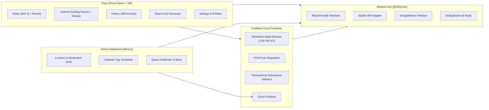

# 365 — "One song. Every day."

> A mobile-first daily music ritual. Everyone on 365 discovers the same single song each day, chosen from songs submitted by the community. Not a Spotify replacement, social network, or recommendation engine.

---

## 1. System Overview & Architecture



### Core Design Philosophy: Material You Done with Taste
- **Hero Artwork Dominance**: Large artwork with generous corner radius (`M3Shapes.extraLarge`), elevated tonal shadow.
- **Dynamic Palette Seed**: On mobile, the active `M3ColorScheme` derives its tonal palette directly from the album artwork's dominant color.
- **Editorial Typography**: Refined serif display pairing (`Fraunces`) for "DAY 47" and song titles with clean sans (`Inter`) for legible body and metadata.
- **Zero AI Slop**: Strict adherence to editorial restraint. No purple-blue gradients, glowing orbs, glassmorphism panels, card clutter, or emoji icons.

---

## 2. Monorepo Structure

```
365/
├── packages/
│   └── core/               # Shared domain types, MusicProvider, SongSelector, deduplication rules
├── apps/
│   ├── mobile/             # Expo React Native app with Expo Router & Reanimated
│   ├── admin/              # Next.js 14+ web dashboard for curation, calendar scheduling & moderation
│   └── backend/            # Firebase Cloud Functions (scheduled daily release, FCM, security rules)
├── .env.example            # Complete environment variable template
├── firestore.rules         # Hardened Firestore security rules
└── package.json            # Monorepo root workspace scripts
```

---

## 3. Quick Start & Local Development

### Prerequisites
- Node.js >= 20.x
- npm >= 10.x

### 1. Install Dependencies
```bash
# In the root repository directory
npm install
```

### 2. Configure Environment Variables
Copy `.env.example` to `.env` in the root:
```bash
cp .env.example .env
```

---

## 4. Service Setup & Keys

### A. Spotify Web API (Catalog Provider)
1. Go to the [Spotify Developer Dashboard](https://developer.spotify.com/dashboard).
2. Create an App (e.g. `365 Ritual Discovery`).
3. Copy the **Client ID** and **Client Secret**.
4. Set `SPOTIFY_CLIENT_ID` and `SPOTIFY_CLIENT_SECRET` in `.env`.
> *Note: If credentials are not provided, `@365/core`'s built-in fallback catalog immediately activates with rich offline tracks (Leon Bridges, Nils Frahm, The Weeknd, etc.) allowing seamless development and testing.*

### B. Firebase Project Configuration
1. Create a project at [Firebase Console](https://console.firebase.google.com/).
2. Enable **Authentication** with Google provider and Anonymous (for Guest mode).
3. Enable **Cloud Firestore** and deploy rules:
   ```bash
   firebase deploy --only firestore:rules,firestore:indexes
   ```
4. Enable **Firebase Cloud Messaging (FCM)** for push notifications.

### C. Seed Database with Initial Data
Run the included seed script to populate sample users, catalog songs, active submissions, and published daily songs:
```bash
npm run seed --workspace=@365/backend
```

---

## 5. Running the Apps

### Mobile App (Expo)
```bash
npm run start --workspace=@365/mobile
```
- Press `w` to open in browser (Expo Web).
- Press `a` to run on connected Android device / emulator.
- Press `i` to run on iOS Simulator.

### Admin Dashboard (Next.js)
```bash
npm run dev --workspace=@365/admin
```
Open [http://localhost:3000](http://localhost:3000) to access:
- **Overview**: Daily stats, today's song status, manual release trigger.
- **Calendar & Select**: Schedule future days on the calendar from the community queue or catalog.
- **Queue**: Search, review, remove, or ban abusive users.
- **Reports**: Handle listener reports on songs or accounts.
- **Release Config**: Edit release time (default 19:00 IST) and timezone.

### Cloud Functions & Emulators
```bash
npm run serve --workspace=@365/backend
```

---

## 6. Core Rules & Push Notifications

### Daily Release Ritual
- Scheduled Cloud Function runs daily at **7:00 PM IST** (`Asia/Kolkata`).
- Publishes that day's scheduled song.
- Dispatches push notifications:
  - **All Opted-in Listeners**: `"🎧 Today's 365 is here."` (Tapping opens today's song).
  - **Submitter**: `"🎉 Your song is today's 365."` (Tapping opens the daily song page).
- **Graceful Fallback**: If no song was pre-scheduled, the `SongSelector` automatically selects the oldest queue candidate. If the queue is also empty, it displays the previous day's song and surfaces an admin alert without crashing.

### Submission Deduplication
- **One active submission per user**: Enforced at rule and database level.
- **Song duplicate prevention**: `"This song is already in the 365 queue."`
- **Guest Gate**: `"Sign in with Google to submit a song."` prevents disposable-account abuse.
- **No estimated selection time**: The success state states `"In the 365 queue"`.

---

## 7. Verification & Automated Tests

Run the complete test suite across workspaces:
```bash
# Run @365/core unit tests (SpotifyProvider, SongSelector, submission rules)
npm run test --workspace=@365/core

# Run TypeScript typechecks across workspaces
npm run typecheck --workspace=@365/core
npm run typecheck --workspace=@365/mobile
npm run typecheck --workspace=@365/admin
npm run typecheck --workspace=@365/backend
```

---

## 8. License
MIT. Built for the daily ritual of discovery.
