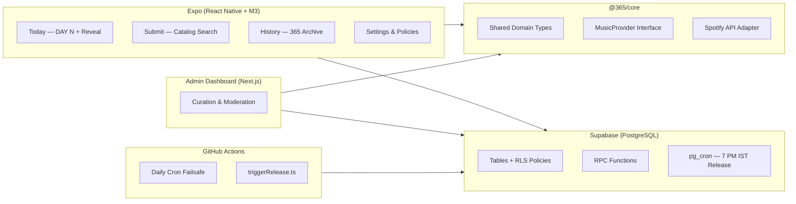

# 365 — "One song. Every day."

> A mobile-first daily music ritual. Everyone on 365 discovers the same single song each day, chosen from songs submitted by the community. Not a Spotify replacement, social network, or recommendation engine.

---

## Architecture



### Design Philosophy
- **Hero Artwork Dominance** — Large album art with generous corner radius, elevated tonal shadow.
- **Dynamic Palette** — `M3ColorScheme` derives its tonal palette from the album artwork's dominant color.
- **Editorial Typography** — `Fraunces` serif for display headings, `Inter` for body.
- **Zero AI Slop** — No purple-blue gradients, glowing orbs, glassmorphism, card clutter, or emoji icons.

---

## Monorepo Structure

```
365/
├── packages/
│   └── core/                  # Shared domain types, MusicProvider, dedup rules
├── apps/
│   ├── mobile/                # Expo React Native app (Expo Router + Reanimated)
│   │   └── android/           # Native Android build (Gradle, signing)
│   ├── admin/                 # Next.js web dashboard for curation & moderation
│   └── backend/               # Release trigger script & package scripts
│       └── supabase/          # Schema SQL (mirror)
├── supabase/
│   └── schema.sql             # Full Supabase schema — tables, RLS, RPC, seed data, pg_cron
├── .github/
│   └── workflows/
│       └── daily-release.yml  # GitHub Actions daily cron failsafe
├── .env.example               # Environment variable template
└── package.json               # Monorepo root (npm workspaces)
```

---

## Zero-Cost Stack

| Layer | Service | Cost |
|-------|---------|------|
| **Database** | Supabase Free Tier (PostgreSQL + RLS + RPC) | $0 |
| **Daily Release** | `pg_cron` inside Supabase + GitHub Actions failsafe | $0 |
| **Auth** | Supabase Auth (Anonymous + Google) | $0 |
| **Music Catalog** | Spotify Web API (Client Credentials) | $0 |
| **CI/CD** | GitHub Actions (2,000 min/mo free) | $0 |
| **Hosting** | N/A — mobile-only, no web hosting needed | $0 |

**Total: $0/month. No credit card required.**

---

## Quick Start

### Prerequisites
- Node.js ≥ 20 · npm ≥ 10
- A free [Supabase](https://supabase.com) project

### 1. Install

```bash
git clone https://github.com/ReturnKartikey/365.git
cd 365
npm install
```

### 2. Set Up Supabase

1. Create a project at [supabase.com/dashboard](https://supabase.com/dashboard).
2. Open the **SQL Editor** and paste the entire contents of [`supabase/schema.sql`](supabase/schema.sql).
3. Click **Run** — you should see "Success. No rows returned."

This creates all tables, RLS policies, RPC functions, seed data, and the `pg_cron` scheduled job.

### 3. Configure Environment

```bash
cp .env.example .env
```

Fill in your Supabase credentials:

```env
SUPABASE_URL=https://<your-project-ref>.supabase.co
SUPABASE_ANON_KEY=<your-anon-key>
SUPABASE_SERVICE_ROLE_KEY=<your-service-role-key>
```

Also copy to `apps/mobile/.env` for the mobile app.

### 4. (Optional) Spotify API

For live catalog search, add your Spotify credentials to `.env`:

```env
SPOTIFY_CLIENT_ID=<your-client-id>
SPOTIFY_CLIENT_SECRET=<your-client-secret>
```

> Without Spotify credentials, `@365/core`'s built-in fallback catalog activates with curated offline tracks.

---

## Running the App

### Mobile (Expo)

```bash
npm run start --workspace=@365/mobile
```

- Press **`a`** → Android device / emulator
- Press **`w`** → Web browser
- Press **`i`** → iOS Simulator

### Admin Dashboard

```bash
npm run dev --workspace=@365/admin
```

### Build APK

```bash
cd apps/mobile/android
./gradlew.bat assembleRelease
```

Output: `apps/mobile/android/app/build/outputs/apk/release/app-release.apk`

---

## Daily Release System

The core ritual: every day at **7:00 PM IST**, one song is published for the entire community.

### Three-Layer Reliability

1. **`pg_cron` (Primary)** — A PostgreSQL cron job inside Supabase calls `execute_daily_release()` at 13:30 UTC daily. Zero infrastructure needed.

2. **GitHub Actions (Failsafe)** — [`.github/workflows/daily-release.yml`](.github/workflows/daily-release.yml) runs at 13:35 UTC as a backup. Requires `SUPABASE_URL` and `SUPABASE_SERVICE_ROLE_KEY` as repository secrets.

3. **CLI (Manual)** — For testing or emergency releases:
   ```bash
   npm run release --workspace=@365/backend
   ```

### How It Works

The `execute_daily_release()` RPC function:
1. Checks if today's song is already published (idempotency guard).
2. If a song is pre-scheduled for today → publishes it.
3. If not → picks the oldest submission from the queue.
4. If the queue is empty → falls back to the `editorial_fallback_pool`.
5. Updates `daily_songs`, marks the submission as `selected`, and increments the submitter's selection count.

---

## Database Schema

Six tables with Row-Level Security:

| Table | Purpose |
|-------|---------|
| `users` | User profiles, submission/selection counts, ban status |
| `daily_songs` | The 365 archive — one row per day |
| `submissions` | Community song queue |
| `config` | App-wide settings (current day number, release time) |
| `reports` | User-submitted reports on songs/users |
| `editorial_fallback_pool` | Curated backup songs when the queue is empty |

Three RPC functions:
- **`submit_song`** — Validates, deduplicates, and inserts a submission. Enforces one active submission per user.
- **`execute_daily_release`** — The daily release logic with full idempotency.
- **`report_item`** — Handles user reports with rate limiting.

---

## Core Rules

### Submission
- **One active submission per user** — enforced at database level.
- **Song deduplication** — prevents the same song from being queued twice.
- **Guest gate** — anonymous users can listen but must sign in to submit.

### Release
- **Idempotent** — calling `execute_daily_release()` multiple times on the same day is safe.
- **Graceful fallback chain** — pre-scheduled → oldest queue entry → editorial fallback pool.
- **No dead days** — the system always has a song to publish.

---

## Scripts

```bash
npm run build          # Build all workspaces
npm run typecheck      # TypeScript checks across all workspaces
npm run release --workspace=@365/backend   # Trigger daily release manually
npm run start --workspace=@365/mobile      # Start Expo dev server
npm run dev --workspace=@365/admin         # Start admin dashboard
```

---

## License

MIT. Built for the daily ritual of discovery.
